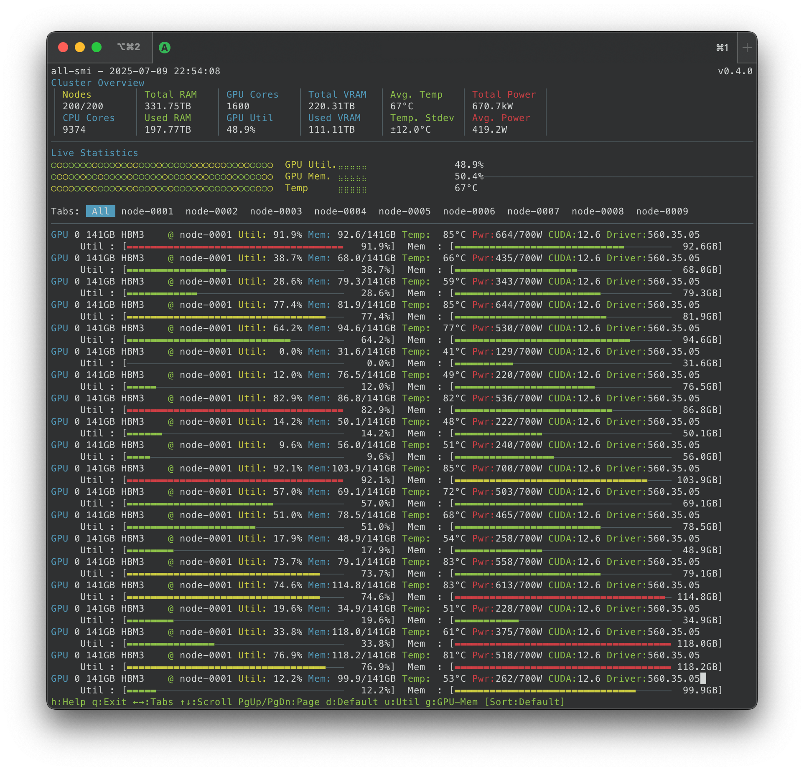
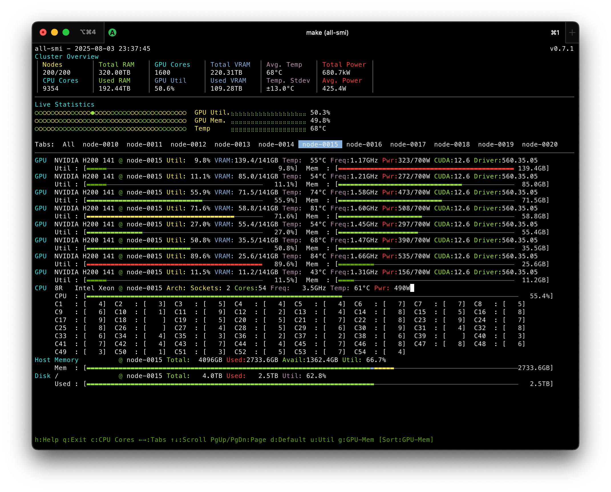

# all-smi

[](https://crates.io/crates/all-smi)
[](https://crates.io/crates/all-smi)


[](https://deps.rs/repo/github/lablup/all-smi)


`all-smi` is a command-line utility for monitoring GPU and NPU hardware across multiple systems. It provides a real-time view of accelerator utilization, memory usage, temperature, power consumption, and other metrics. The tool is designed to be a cross-platform alternative to `nvidia-smi`, with support for NVIDIA GPUs, AMD GPUs, NVIDIA Jetson platforms, Apple Silicon GPUs, Intel Gaudi NPUs, Google Cloud TPUs, Tenstorrent NPUs, Rebellions NPUs, and Furiosa NPUs.

The application presents a terminal-based user interface with cluster overview, interactive sorting, and both local and remote monitoring capabilities. It also provides an API mode for Prometheus metrics integration.



<p align="center">All-node view (remote mode)</p>



<p align="center">Node view (remote mode)</p>

## Installation

### Option 1: Install via Homebrew (macOS/Linux)

The easiest way to install all-smi on macOS and Linux is through Homebrew:

```bash
brew tap lablup/tap
brew install all-smi
```

### Option 2: Install via Ubuntu PPA

For Ubuntu users, all-smi is available through the official PPA:

```bash
# Add the PPA repository
sudo add-apt-repository ppa:lablup/backend-ai
sudo apt update

# Install all-smi
sudo apt install all-smi
```

The PPA provides automatic updates and is maintained for Ubuntu 22.04 (Jammy) and 24.04 (Noble).

### Option 3: Install via Debian Package

For Debian and other Debian-based distributions, download the `.deb` package from the [releases page](https://github.com/inureyes/all-smi/releases):

```bash
# Download the latest .deb package (replace VERSION with the actual version)
wget https://github.com/inureyes/all-smi/releases/download/vVERSION/all-smi_VERSION_OS_ARCH.deb
# Example: all-smi_0.7.0_ubuntu24.04.noble_amd64.deb

# Install the package
sudo dpkg -i all-smi_VERSION_OS_ARCH.deb

# If there are dependency issues, fix them with:
sudo apt-get install -f
```

### Option 4: Download Pre-built Binary

Download the latest release from the [GitHub releases page](https://github.com/inureyes/all-smi/releases):

1. Go to https://github.com/inureyes/all-smi/releases
2. Download the appropriate binary for your platform
3. Extract the archive and place the binary in your `$PATH`

### Option 5: Install from Cargo

Install all-smi through Cargo:

```bash
cargo install all-smi
```

After installation, the binary will be available in your `$PATH` as `all-smi`.

### Option 6: Build from Source

See [Building from Source](DEVELOPERS.md#building-from-source) in the developer documentation.

## Usage

### Command Overview

```bash
# Show help
all-smi --help

# Local monitoring (requires sudo on macOS) - default when no command specified
all-smi
sudo all-smi local

# Remote monitoring (requires API endpoints)
all-smi view --hosts http://node1:9090 http://node2:9090
all-smi view --hostfile hosts.csv

# API mode (expose metrics server)
all-smi api --port 9090
```

### Local Mode (Monitor Local Hardware)

The `local` mode monitors your local GPUs/NPUs with a terminal-based interface. This is the default when no command is specified.

```bash
# Monitor local GPUs (requires sudo on macOS)
all-smi              # Default to local mode
sudo all-smi local   # Explicit local mode

# With custom refresh interval
sudo all-smi local --interval 5
```

### Remote View Mode (Monitor Remote Nodes)

The `view` mode monitors multiple remote systems that are running in API mode. This mode requires specifying remote endpoints.

```bash
# Direct host specification (required)
all-smi view --hosts http://gpu-node1:9090 http://gpu-node2:9090

# Using host file (required)
all-smi view --hostfile hosts.csv --interval 2
```

**Note:** The `view` command requires either `--hosts` or `--hostfile`. For local monitoring, use `all-smi local` instead.

Host file format (CSV):
```
http://gpu-node1:9090
http://gpu-node2:9090
http://gpu-node3:9090
```

## Platform-Specific Requirements

### macOS (Apple Silicon)
- **No sudo required:** Uses native macOS APIs for metrics collection
  - Uses IOReport API and Apple SMC directly
  - Provides actual temperature readings from SMC sensors
  - Run with: `all-smi local`

### Linux with AMD GPUs
- **Sudo Access Required:** AMD GPU monitoring requires `sudo` to access `/dev/dri` devices
- **ROCm Installation:** AMD GPU support requires ROCm drivers and libraries
- **Build Requirements:**
  - AMD GPU support is available in **glibc builds only** (`x86_64-unknown-linux-gnu`, `aarch64-unknown-linux-gnu`)
  - **Not available in musl builds** (`x86_64-unknown-linux-musl`, `aarch64-unknown-linux-musl`) due to library compatibility
  - For static binaries with AMD GPU support, use the glibc builds
- **Permissions:** Add user to `video` and `render` groups as an alternative to sudo:
  ```bash
  sudo usermod -a -G video,render $USER
  # Log out and back in for changes to take effect
  ```

### Linux with NVIDIA GPUs
- **No Sudo Required:** NVIDIA GPU monitoring works without sudo privileges
- **Driver Required:** NVIDIA proprietary drivers must be installed

### Windows
- **No Sudo Required:** GPU and CPU monitoring works without administrator privileges
- **CPU Temperature Limitations:**
  - Standard Windows WMI thermal zones (MSAcpi_ThermalZoneTemperature) are not available on all systems
  - The application uses a fallback chain to try multiple temperature sources:
    1. ACPI Thermal Zones (standard WMI)
    2. AMD Ryzen Master SDK (AMD CPUs - requires AMD drivers or Ryzen Master)
    3. Intel WMI (Intel CPUs - if chipset drivers support it)
    4. LibreHardwareMonitor WMI (any CPU - if [LibreHardwareMonitor](https://github.com/LibreHardwareMonitor/LibreHardwareMonitor) is running)
  - If temperature is not available, it will be shown as "N/A" without error messages
  - For best temperature monitoring on Windows, install and run LibreHardwareMonitor in the background

## Features

### GPU Monitoring
- **Real-time Metrics:** Displays comprehensive GPU information including:
  - GPU Name and Driver Version
  - Utilization Percentage with color-coded status
  - Memory Usage (Used/Total in GB)
  - Temperature in Celsius (or Thermal Pressure for Apple Silicon)
  - Clock Frequency in MHz
  - Power Consumption in Watts (2 decimal precision for Apple Silicon)
- **Multi-GPU Support:** Handles multiple GPUs per system with individual monitoring
- **Interactive Sorting:** Sort GPUs by utilization, memory usage, or default (hostname+index) order
- **Platform-Specific Features:**
  - NVIDIA: PCIe info, performance states, power limits
  - AMD: VRAM/GTT memory tracking, fan speed monitoring, GPU process detection with fdinfo
  - NVIDIA Jetson: DLA utilization monitoring
  - Apple Silicon: ANE power monitoring, thermal pressure levels
  - Intel Gaudi NPUs: AIP utilization monitoring, HBM memory tracking, device variant detection (PCIe/OAM/UBB)
  - Google Cloud TPUs: Support for TPU v2-v7/Ironwood, HBM memory tracking, libtpu/JAX integration
  - Tenstorrent NPUs: Real-time telemetry via luwen library, board-specific TDP calculations
  - Rebellions NPUs: Performance state monitoring, KMD version tracking, device status
  - Furiosa NPUs: Per-core PE utilization, power governor modes, firmware version tracking
  
### CPU Monitoring
- **Comprehensive CPU Metrics:**
  - Real-time CPU utilization with per-socket breakdown
  - Core and thread counts
  - Frequency monitoring (P+E format for Apple Silicon)
  - Temperature and power consumption
- **Apple Silicon Enhanced:**
  - P-core and E-core utilization tracking
  - P-cluster and E-cluster frequency monitoring
  - Integrated GPU core count

### Memory Monitoring
- **System Memory Tracking:**
  - Total, used, available, and free memory
  - Memory utilization percentage
  - Swap space monitoring
  - Linux: Buffer and cache memory tracking
- **Visual Indicators:** Color-coded memory usage bars

### Process Monitoring
- **Enhanced GPU Process View:**
  - Process ID (PID) and Parent PID
  - Process Name and Command Line
  - GPU Memory Usage with per-column coloring
  - CPU usage percentage
  - User and State Information
- **Advanced Features:**
  - Mouse click sorting on column headers
  - Multi-criteria sorting (PID, memory, GPU memory, CPU usage)
  - Per-column color coding for better visibility
  - Full process tree integration

### Chassis/Node-Level Monitoring
- **System-Wide Power Tracking:**
  - Total chassis power consumption (CPU+GPU+ANE combined)
  - Individual power component breakdown
  - Real-time power efficiency monitoring
- **Thermal Monitoring:**
  - Thermal pressure levels (Apple Silicon)
  - Inlet/outlet temperature tracking (BMC-enabled servers)
  - Fan speed monitoring with per-fan granularity
- **Platform-Specific Features:**
  - Apple Silicon: CPU, GPU, ANE power breakdown with thermal pressure
  - Server systems: BMC sensor integration for comprehensive thermal monitoring

### Cluster Management
- **Cluster Overview Dashboard:** Real-time statistics showing:
  - Total nodes and GPUs across the cluster
  - Average utilization and memory usage
  - Temperature statistics with standard deviation
  - Total and average power consumption
- **Live Statistics History:** Visual graphs showing utilization, memory, and temperature trends
- **Tabbed Interface:** Switch between "All" view and individual host tabs
- **Adaptive Update Intervals:**
  - Local monitoring: 1 second (Apple Silicon) or 2 seconds (others)
  - 1-10 remote nodes: 3 seconds
  - 11-50 nodes: 4 seconds
  - 51-100 nodes: 5 seconds
  - 101+ nodes: 6 seconds

### Cross-Platform Support
- **Linux:**
  - NVIDIA GPUs via NVML and nvidia-smi (fallback)
  - AMD GPUs (Radeon and Instinct) via ROCm and libamdgpu_top library
    - Real-time VRAM and GTT memory monitoring
    - GPU process detection with memory usage tracking
    - Temperature, power consumption, frequency, and fan speed metrics
    - Requires sudo access to /dev/dri devices (glibc builds only)
  - CPU monitoring via /proc filesystem
  - Memory monitoring with detailed statistics
  - Intel Gaudi NPUs (Gaudi 1/2/3) via hl-smi with background process monitoring
  - Google Cloud TPUs (v2-v7/Ironwood) via libtpu with JAX/Python integration
  - Tenstorrent NPUs (Grayskull, Wormhole, Blackhole) via luwen library
  - Rebellions NPUs (ATOM, ATOM+, ATOM Max) via rbln-stat
  - Furiosa NPUs (RNGD) via furiosa-smi
- **macOS:**
  - Apple Silicon (M1/M2/M3/M4) GPUs monitoring
  - Native APIs: IOReport, SMC for no-sudo operation
  - ANE (Apple Neural Engine) power tracking
  - Actual CPU/GPU temperature readings from SMC sensors
  - Thermal pressure monitoring
  - P/E core architecture support
- **NVIDIA Jetson:** 
  - Special support for Tegra-based systems
  - DLA (Deep Learning Accelerator) monitoring

### Remote Monitoring
- **Multi-Host Support:** Monitor up to 256+ remote systems simultaneously
- **Connection Management:** Optimized networking with:
  - Connection pooling (200 idle connections per host)
  - Concurrent connection limiting (64 max)
  - Automatic retry with exponential backoff
  - TCP keepalive for persistent connections
  - Connection staggering to prevent overload
- **Storage Monitoring:** Disk usage information for all hosts
- **High Availability:** Resilient to connection failures with automatic recovery

### Interactive UI
- **Enhanced Controls:**
  - Keyboard: Arrow keys, Page Up/Down, Tab switching
  - Mouse: Click column headers to sort (process view)
  - Sorting: 'd' (default), 'u' (utilization), 'g' (GPU memory), 'p' (PID), 'm' (memory), 'c' (CPU)
  - Interface: '1'/'h' (help), 'q' (quit), ESC (close help)
- **Visual Design:**
  - Color-coded status: Green (≤60%), Yellow (60-80%), Red (>80%)
  - Per-column coloring in process view
  - Responsive layout adapting to terminal size
  - Double-buffered rendering for flicker-free display
- **Help System:** Context-sensitive help with all keyboard shortcuts

### Development & Testing
- **Mock Server:** Built-in mock server for testing and development
  - Simulates realistic GPU clusters with 8 GPUs per node
  - Configurable port ranges for multiple instances
  - Failure simulation for resilience testing
  - Platform-specific metric generation (NVIDIA, AMD, Apple Silicon, Jetson, Intel Gaudi, Google TPU, Tenstorrent, Rebellions, Furiosa)
  - Background metric updates with realistic variations
- **Performance Optimized:**
  - Template-based response generation
  - Efficient memory management
  - Minimal CPU overhead

### API Mode (Prometheus Metrics)

Expose hardware metrics in Prometheus format for integration with monitoring systems:

```bash
# Start API server on TCP port
all-smi api --port 9090

# Custom update interval (default: 3 seconds)
all-smi api --port 9090 --interval 5

# Include process information
all-smi api --port 9090 --processes

# Unix Domain Socket support (Unix only)
all-smi api --socket                              # Default path
all-smi api --socket /custom/path.sock            # Custom path
all-smi api --port 9090 --socket                  # TCP + UDS simultaneously
all-smi api --port 0 --socket                     # UDS only (disable TCP)

# Access via Unix socket
curl --unix-socket /tmp/all-smi.sock http://localhost/metrics
```

**Unix Domain Socket Details:**
- Default paths: `/tmp/all-smi.sock` (macOS), `/var/run/all-smi.sock` or `/tmp/all-smi.sock` (Linux)
- Socket permissions are set to `0600` for security (owner-only access)
- Socket file is automatically cleaned up on shutdown
- Currently Unix-only (Linux, macOS); Windows support pending Rust ecosystem maturity

Metrics are available at `http://localhost:9090/metrics` (TCP) or via Unix socket and include comprehensive hardware monitoring for:
- **GPUs:** Utilization, memory, temperature, power, frequency (NVIDIA, AMD, Apple Silicon, Intel Gaudi, Google TPU, Tenstorrent)
- **CPUs:** Utilization, frequency, temperature, power (with P/E core metrics for Apple Silicon)
- **Memory:** System and swap memory statistics
- **Storage:** Disk usage information
- **Chassis:** Node-level power consumption, thermal pressure, inlet/outlet temperatures, fan speeds
- **Processes:** GPU process metrics including AMD fdinfo-based tracking (with --processes flag)

For a complete list of all available metrics, see [API.md](API.md).

### Quick Start with Make Commands

For development and testing, you can use the provided Makefile:

```bash
# Run local monitoring
make local

# Run remote view mode with hosts file
make remote

# Start mock server for testing
make mock

# Build release version
make release

# Run tests
make test
```

## Library API

`all-smi` can also be used as a Rust library for building custom monitoring tools or integrating hardware metrics into your applications.

### Add Dependency

Add to your `Cargo.toml`:

```toml
[dependencies]
all-smi = "0.15"
```

### Basic Usage

```rust
use all_smi::{AllSmi, Result};

fn main() -> Result<()> {
    // Initialize with auto-detection
    let smi = AllSmi::new()?;

    // Get all GPU/NPU information
    for gpu in smi.get_gpu_info() {
        println!("{}: {}% utilization, {:.1}W",
            gpu.name, gpu.utilization, gpu.power_consumption);
    }

    // Get CPU information
    for cpu in smi.get_cpu_info() {
        println!("{}: {:.1}% utilization", cpu.cpu_model, cpu.utilization);
    }

    // Get memory information
    for mem in smi.get_memory_info() {
        println!("Memory: {:.1}% used", mem.utilization);
    }

    Ok(())
}
```

### Using the Prelude

For convenience, import all common types:

```rust
use all_smi::prelude::*;

fn main() -> Result<()> {
    let smi = AllSmi::new()?;

    // Types like GpuInfo, CpuInfo, MemoryInfo are available
    let gpus: Vec<GpuInfo> = smi.get_gpu_info();
    println!("Found {} GPU(s)", gpus.len());

    Ok(())
}
```

### Available Methods

| Method | Returns | Description |
|--------|---------|-------------|
| `get_gpu_info()` | `Vec<GpuInfo>` | GPU/NPU metrics (utilization, memory, temp, power) |
| `get_cpu_info()` | `Vec<CpuInfo>` | CPU metrics (utilization, frequency, temp) |
| `get_memory_info()` | `Vec<MemoryInfo>` | System memory metrics |
| `get_process_info()` | `Vec<ProcessInfo>` | GPU process information |
| `get_chassis_info()` | `Option<ChassisInfo>` | Node-level power and thermal info |

### Configuration

```rust
use all_smi::{AllSmi, AllSmiConfig};

let config = AllSmiConfig::new()
    .sample_interval(500)  // 500ms sample interval
    .verbose(true);        // Enable verbose warnings

let smi = AllSmi::with_config(config)?;
```

### Thread Safety

`AllSmi` is `Send + Sync` and can be safely shared across threads:

```rust
use std::sync::Arc;
use std::thread;

let smi = Arc::new(AllSmi::new()?);

let smi_clone = smi.clone();
thread::spawn(move || {
    let gpus = smi_clone.get_gpu_info();
    // ...
});
```

For more examples, see `examples/library_usage.rs` in the repository.

## Development

For development documentation including building from source, testing with mock servers, architecture details, and technology stack information, see [DEVELOPERS.md](DEVELOPERS.md).

## Testing

For comprehensive testing documentation including unit tests, integration tests, and shell script tests, see [TESTING.md](TESTING.md).

### Quick Test Commands
```bash
# Run all unit tests (no sudo required)
cargo test

# Run tests including those requiring sudo (macOS only)
sudo cargo test -- --include-ignored

# Run shell script tests for containers and real-world scenarios
cd tests && make all
```

## Contributing

Contributions are welcome! Areas for contribution include:

- **Platform Support:** Additional GPU vendors or operating systems
- **Features:** New metrics, visualization improvements, or monitoring capabilities
- **Performance:** Optimization for larger clusters or resource usage
- **Documentation:** Examples, tutorials, or API documentation

Please submit pull requests or open issues for bugs, feature requests, or questions.

## Acknowledgments

This project is being developed with tremendous help from [Claude Code](https://claude.ai/code) and [Gemini CLI](https://github.com/google-gemini/gemini-cli). These AI-powered development tools have been instrumental in accelerating the development process, improving code quality, and implementing complex features across multiple hardware platforms.

The journey of building all-smi with AI assistance has been a fascinating exploration of how domain expertise guides AI capabilities. From the initial three-day Rust learning sprint with Google AI Studio and ChatGPT to the recent development with Gemini CLI and Claude Code, this project demonstrates that the boundary of AI coding capability is tightly bound by the expertise of the person guiding it. [Read the full development story here](docs/AI_DEVELOPMENT_STORY.md).

## License

This project is licensed under the Apache License 2.0.  
See the [LICENSE](./LICENSE) file for details.

## Changelog

### Recent Updates
- **v0.15.2 (2026/01/02):** Fix Rebellions NPU detection compatibility with rbln SDK 2.0.x
- **v0.15.1 (2025/12/31):** Fix memory leak in IOReportIterator on Apple Silicon by properly releasing CFDictionaryRef
- **v0.15.0 (2025/12/31):** Add Unix Domain Socket support for API mode, Windows CPU temperature fallback chain, binary size optimization, and repository organization change
- **v0.14.0 (2025/12/25):** Add Windows x64 build target, native macOS APIs for no-sudo monitoring, chassis/node-level power monitoring, and remove legacy powermetrics
- **v0.13.1 (2025/12/23):** Upgrade tonic/prost to 0.14, wmi to 0.18, libloading to 0.9, and optimize build dependencies
- **v0.13.0 (2025/12/23):** Add Google Cloud TPU monitoring support (v2-v7/Ironwood), optimize CPU utilization with improved polling and rendering
- **v0.12.0 (2025/12/07):** Add Windows build support, fix AMD GPU dependencies in Dockerfile builder stage
- **v0.11.0 (2025/11/25):** Add Intel Gaudi 3 AI accelerator support, unified AI acceleration library naming for cross-platform consistency, GPU/NPU reader caching optimization for performance, and AMD GPU driver version extraction
- **v0.10.0 (2025/11/21):** Add AMD GPU support with ROCm/libamdgpu_top integration, comprehensive security and performance review with critical fixes, refactor data collection with Strategy pattern, enhanced parsing macros, and Linux-only NPU support
- **v0.9.0 (2025/08/29):** Separate local/remote monitoring commands, Backend.AI cluster auto-discovery, modular refactoring for better maintainability, and Prometheus metric fixes
- **v0.8.0 (2025/08/08):** Container-aware resource monitoring, enhanced ARM CPU frequency detection, UI improvements for process list, license change to Apache 2.0, and PPA build enhancements
- **v0.7.2 (2025/08/06):** Reorganize man page location in release archives, add GPU core count for Apple Silicon, animated loading progress bar, and fix display issues
- **v0.7.1 (2025/08/03):** Add manpage for Debian/Ubuntu package, updated installation guide with PPA support, and fixed debian_build workflow
- **v0.7.0 (2025/08/02):** Add Furiosa RNGD NPU support, Debian/Ubuntu PPA packaging, scrolling device names, and improved CI/CD workflows
- **v0.6.3 (2025/07/28):** Add Rebellions ATOM NPU support with secure container monitoring
- **v0.6.2 (2025/07/25):** Added multi-segment bar visualization with stacked memory display, CPU temperature for Linux, CPU cache detection, per-core CPU metrics, and fixed-width CPU display formatting
- **v0.6.1 (2025/07/19):** Fixed multi-node view hanging, improved hostname handling, optimized network fetch, and updated Ubuntu release workflows
- **v0.6.0 (2025/07/18):** Added Tenstorrent NPU support, improved UI alignment and terminal resize handling, modularized API metrics, and enhanced disk filtering
- **v0.5.0 (2025/07/12):** Enhanced Apple Silicon support with ANE power in watts, P+E frequency display, thermal pressure text, interactive process sorting, and configurable PowerMetrics intervals
- **v0.4.3 (2025/07/11):** Fix P-CPU/E-CPU gauges for all Apple Silicon variants (M1/M2/M3/M4) including M1 Pro hybrid format
- **v0.4.2 (2025/07/10):** Eliminate PowerMetrics temp file growth with in-memory buffer, Homebrew installation support
- **v0.4.1 (2025/07/10):** Mock server improvements, efficient Apple Silicon and NVidia GPU support
- **v0.4.0 (2025/07/08):** Architectural refactoring, Smart sudo detection and comprehensive unit testing
- **v0.3.3 (2025/07/07):** CPU, Memory, and ANE support, and UI fixes
- **v0.3.2 (2025/07/06):** Cargo.toml for publishing and release process
- **v0.3.1 (2025/07/06):** GitHub actions and Dockerfile, and UI fixes
- **v0.3.0 (2025/07/06):** Multi-architecture support, optimized space allocation, enhanced UI
- **v0.2.2 (2025/07/06):** GPU sorting functionality with hotkeys
- **v0.2.1 (2025/07/05):** Help system improvements and code refactoring
- **v0.2.0 (2025/07/05):** Remote monitoring and cluster management features
- **v0.1.1 (2025/07/04):** ANE (Apple Neural Engine) support, page navigation keys, and scrolling fixes
- **v0.1.0 (2024/08/11):** Initial release with local GPU monitoring
